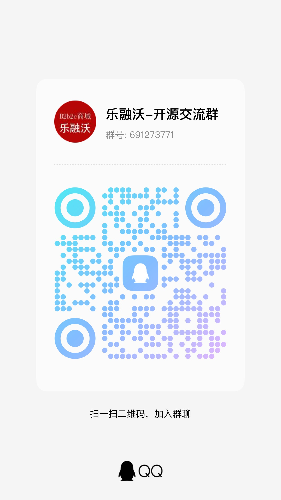
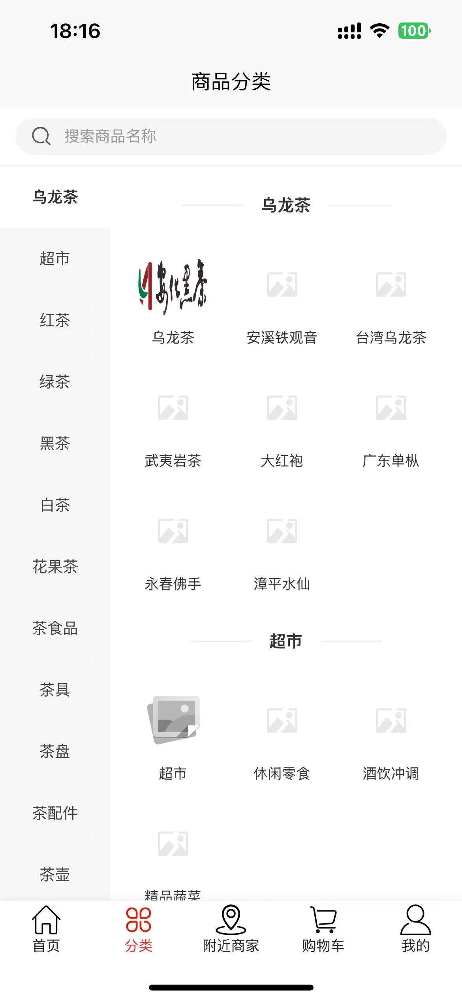
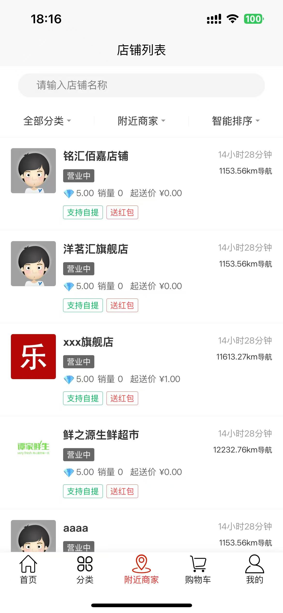
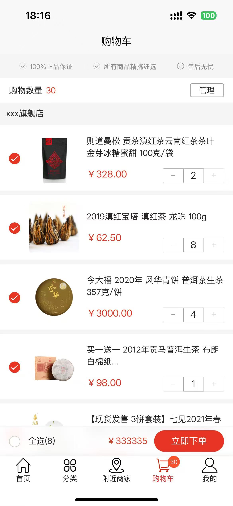
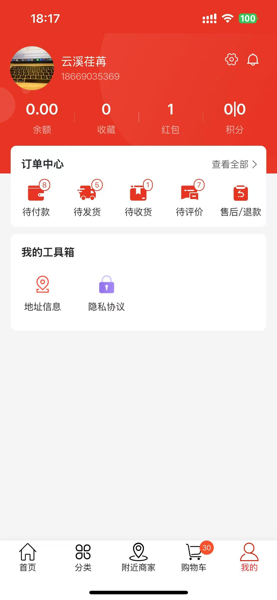
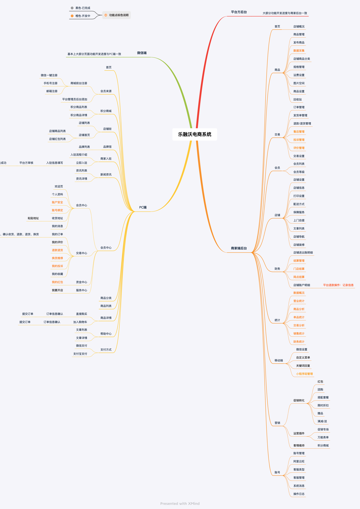

# 乐融沃b2b2c商城开源版

注：已同步最新开发版本到开源版本，以后会直接在该开源项目下进行更新迭代，欢迎开发者大神为该项目作贡献（PR）。

*<u>开源不易，如果该项目对您有帮助，请点击右上角的“Star”按钮收藏，以获取最新更新。</u>*

#### 项目介绍
乐融沃b2b2c多商户开源版是一款轻量级、高性能的电商系统，支持H5和公众号。该系统完全开源，前后端源码100%开放，可自由二次开发，快速搭建个性化独立商城。技术架构采用PHP8.2和Laravel10，专注于轻量、可持续和稳定的高可用系统，适用于学习和商业用途。

#### 技术特点
* 采用PHP 8.2 (强类型严格模式)
* Laravel 10.*（优雅的PHP开发框架）
* 支持`octane`整站加速（利用`swoole`或`roadrunner`）
* 支持自适应APP或小程序端接口（使用Laravel官方的插件`sanctum`实现api接口开发）
* 前端首页支持丰富的模版自定义装修
* 丰富的营销工具助力商城的有效运营及客户转化
* 用户端采用 `uniapp` 多端合一技术（安卓、iOS、微信小程序、公众号H5等。注：`uniapp`已停止更新了，不建议直接使用！）

#### 开源交流群
* QQ群：691273771

#### 微信公众号

#### 商城系统开发说明
请参考以下链接了解商城系统的开发说明：

#### 系统演示
您可以通过以下链接查看系统的演示效果：

- PC端演示[octane加速]：http://www.shop.laravelvip.com/

- 微信端演示[octane加速]：http://m.shop.laravelvip.com/

- 安卓APP端演示：https://www.pgyer.com/35fYkO0L

#### APP端运行效果图

#### 源码下载
您可以通过以下链接下载该项目的源码：

1. 主商城端（又称后端、服务端，PHP开发 用于管理后台和提供api接口）

   下载地址：[https://gitee.com/laravelmall/laravelvip-b2b2c](https://gitee.com/laravelmall/laravelvip-b2b2c)

2. 用户端（也叫客户端、前端，uniapp开发 用于生成H5和微信小程序）(注：用户端开源版项目已停止更新)

   下载地址：[https://gitee.com/laravelmall/laravelvip-uni-app](https://gitee.com/laravelmall/laravelvip-uni-app)

   注：最新版的uniapp用户端不对外开源！！！ 如有需要请联系作者获取。

#### 环境要求
- CentOS 7.0+
- Nginx 1.10+
- PHP 8.2+
- MySQL 8.0+
- Redis 7.0+

#### 如何安装（同样适用于本地其他开发环境，如：homestead）
请参考以下链接了解如何在服务器上安装该系统：

- 哔哩哔哩：[乐融沃商城系统宝塔面板部署教程](https://www.bilibili.com/video/BV13w4m1m7RQ/)
- [宝塔面板部署教程（web界面一键安装，适用于无编程基础的用户）](./md/宝塔面板部署教程.md)

注：`web界面一键安装` 仅适用于真实域名Linux服务器上部署安装，如果是本地开发环境安装，请参考 `手动命令行部署教程`

- [手动命令行部署教程（命令行模式安装，适用于有一定编程基础的开发人员）](./md/手动命令行部署教程.md)

#### 后台地址

- 平台方管理地址：http://backend.你的域名.com/
- 默认的账户密码：admin 123456
- 商家方管理地址：http://seller.你的域名.com/
- PC前端地址：http://www.你的域名.com/
- 手机端地址：http://m.你的域名.com/

#### 系统功能列表

#### 常见问题

- 如果安装完成后，不能正常访问，请提交issue反馈，比如：使用的操作系统、php环境及版本信息、错误提示截图等信息，这边会根据反馈信息对bug进行修复处理。
- 旧版本升级暂只支持 `v4.3.0` 以后的版本通过后台自动升级

    **_注：升级后建议重新执行`composer install` 安装`composer`依赖_**
  
    **_注：为确保代码完整，请从gitee拉取master分支的最新代码后，再点击升级按钮进行升级_**

- 使用`web界面一键安装`方式时，提示`执行seeder数据填充失败，状态码：0`，该种方式不适用于本地开发环境安装，请参考 `手动命令行部署教程`进行安装。

#### 版权须知

1. 允许个人学习研究使用，支持二次开发，允许商业用途（仅限自运营）。
2. 允许商业用途，但仅限自运营，如果商用必须保留版权信息，望自觉遵守。
3. 不允许对程序代码以任何形式任何目的的再发行或出售，否则将追究侵权者法律责任。

#### 购买正版授权 获取 License 四大权益
1. 经营合法合规：合法合规使用乐融沃商城系统进行商业运行，避免法律纠纷，突显商业信誉
2. 专享版下载：购买授权后，可随时从官方获取最新license专享版
3. 替换版权信息：可自行替换底部 Powered By 版权信息，无任何法律风险
4. 技术支持：售后可以正常获得官方技术服务支持，确保网站稳定运行

#### 如何获取正版授权？
1. 请添加 QQ：410284576获取

本项目包含的第三方源码和二进制文件之版权信息另行标注。

版权所有Copyright © 2018-2028 By 乐融沃 All rights reserved。
